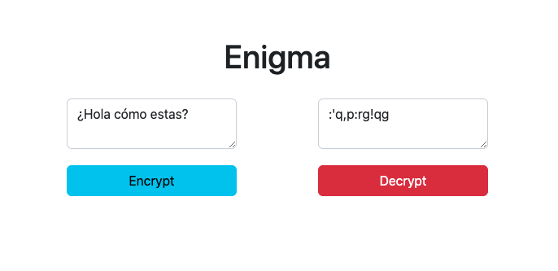

# Enigma

This javascript exercise is about encrypting or decrypting a text entered by the user.

There are two text fields and two buttons. 

In the left field you type the decrypted text and in the right field you type the encrypted text.

Then each button performs the function of encrypting or decrypting as shown in the image.

